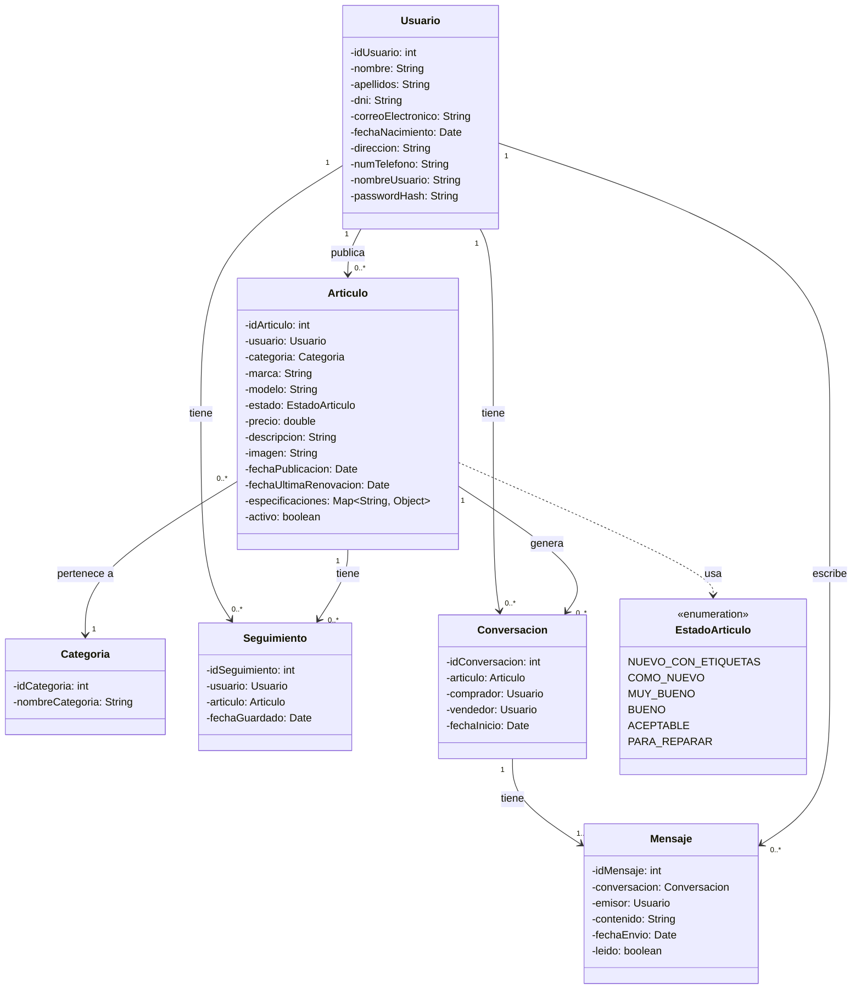

```mermaid
classDiagram

class Usuario {
    -idUsuario: int
    -nombre: String
    -apellidos: String
    -dni: String
    -correoElectronico: String
    -fechaNacimiento: Date
    -direccion: String
    -numTelefono: String
    -nombreUsuario: String
    -passwordHash: String
}

class Articulo {
    -idArticulo: int
    -usuario: Usuario
    -categoria: Categoria
    -marca: String
    -modelo: String
    -estado: EstadoArticulo
    -precio: double
    -descripcion: String
    -imagen: String
    -fechaPublicacion: Date
    -fechaUltimaRenovacion: Date
    -especificaciones: Map~String, Object~
    -activo: boolean
}

class Categoria {
    -idCategoria: int
    -nombreCategoria: String
}

class Seguimiento {
    -idSeguimiento: int
    -usuario: Usuario
    -articulo: Articulo
    -fechaGuardado: Date
}

class Conversacion {
    -idConversacion: int
    -articulo: Articulo
    -comprador: Usuario
    -vendedor: Usuario
    -fechaInicio: Date
}

class Mensaje {
    -idMensaje: int
    -conversacion: Conversacion
    -emisor: Usuario
    -contenido: String
    -fechaEnvio: Date
    -leido: boolean
}

class EstadoArticulo {
    <<enumeration>>
    NUEVO_CON_ETIQUETAS
    COMO_NUEVO
    MUY_BUENO
    BUENO
    ACEPTABLE
    PARA_REPARAR
}

Usuario "1" --> "0..*" Articulo : publica
Articulo "0..*" --> "1" Categoria : pertenece a

Usuario "1" --> "0..*" Seguimiento : tiene
Articulo "1" --> "0..*" Seguimiento : tiene

Usuario "1" --> "0..*" Conversacion : tiene
Articulo "1" --> "0..*" Conversacion : genera

Conversacion "1" --> "1..*" Mensaje : tiene
Usuario "1" --> "0..*" Mensaje : escribe

Articulo ..> EstadoArticulo : usa
```
